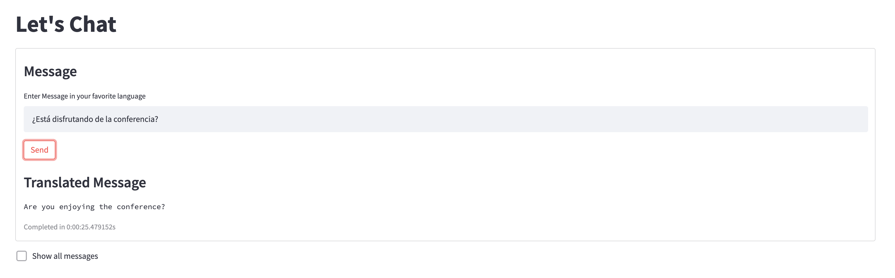

# Neural Translation Using Couchbase

## Running Couchbase

- Couchbase can be run as a Docker container

  `docker run -d -p 8091-8096:8091-8096 -p 11210:11210 --name ml_db couchbase`

- Setting Up

  Access Couchbase Web Console at http://localhost:8091/

  While setting up, enable Analytics, Data, Query and Indexing Service in Couchbase.

  More information on setting up can be found [here](https://docs.couchbase.com/server/current/getting-started/do-a-quick-install.html).

- Enabling Python UDFs on Couchbase

  We need to enable the developer preview mode to enable us to use the machine learning capabilities of Couchbase.

  `docker exec -it ml_db bash /opt/couchbase/bin/couchbase-cli enable-developer-preview -c localhost:8091 -u <username> -p <password> --enable`

## Using the Pre-trained Model

- Install the requirements

  `pip install -r requirements.txt`

- The model used is a pre trained multi lingual model, `Helsinki-NLP/opus-mt-mul-en` that translates from multiple common languages into English. The model is available on [hugging face](https://huggingface.co/Helsinki-NLP).

## Packaging the Model

- The machine learning model can be packaged including all the dependencies using [shiv](https://github.com/linkedin/shiv) for any platform. We use Linux here for our container.

  `shiv --site-packages pipeline/ -o trans-lib.pyz --platform manylinux1_x86_64 --python-version 39 --only-binary=:all: transformers torch`

- Copy the package into the Couchbase Container
  `docker cp trans-lib.pyz ml_db:/tmp/`

## Deploying the Model

- Log in to Docker Container running Couchbase

  `docker exec -it ml_db bash`

- Deploy the model into Couchbase Analytics Service

  `cd /tmp`

  `curl -v -X POST -F "data=@./trans-lib.pyz" -F "type=python" "localhost:8095/analytics/library/Default/translib" -u <username>:<password>;`

## Create the User Defined Function in Couchbase Analytics

- Run the User Defined Function Definition in [Couchbase Analytics Query Workbench](https://docs.couchbase.com/server/current/analytics/run-query.html)

  `USE DEFAULT;`

  `CREATE ANALYTICS FUNCTION translate(text) AS "trans_lib", "Translate.translate_text" AT translib;`

## Run Machine Learning Inference

- Call the User Defined Function in Analytics Workbench

  `SELECT translate("hallo") as translation`

- The output from ML model can be seen on the output window

  ```
  [
    {
        "translation": [
        {
            "translation_text": "Hello"
        }
        ]
    }
  ]
  ```

## Running the Machine Learning Interface using Python App

There is a sample [application](chat_app.py) written using [Streamlit](https://streamlit.io/) to access the inference using Python.

### Running the Application

- Create a bucket like `messages` in Couchbase to store the insurance quotes. Also create the primary index for the bucket so that we can access the data using SQL++ queries.
  `` CREATE PRIMARY INDEX on `messages` ``
- The database settings are accessed from a `.env` file. Create a copy of `.env.example` & rename it to `.env` & add the values for the bucket, host name and credentials for your Couchbase cluster.
- Run the application
  `streamlit run chat_app.py`
- The application can be used to run inference against the model running on Couchbase.
- There is an instant translation for all the messages being sent in the system.
  
- Apart from this, the latest messages can be viewed in a table along with the corresponding translations.
  
